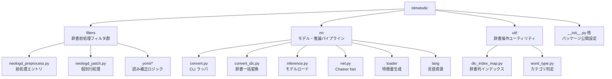
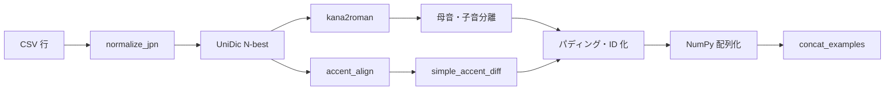
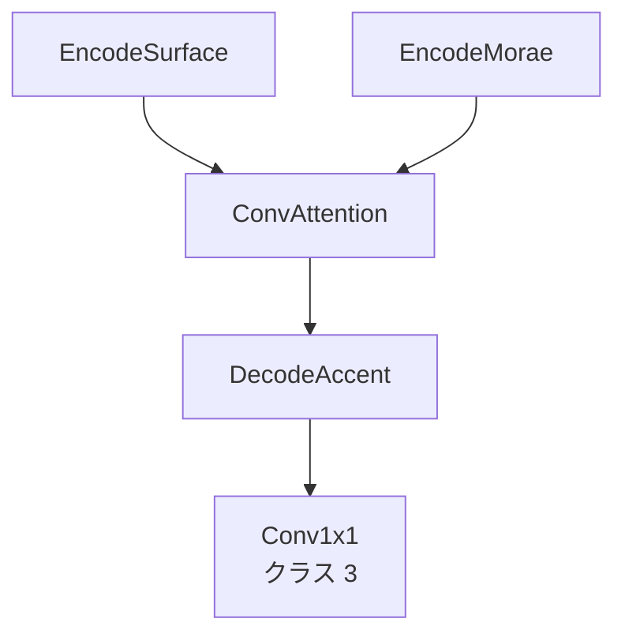
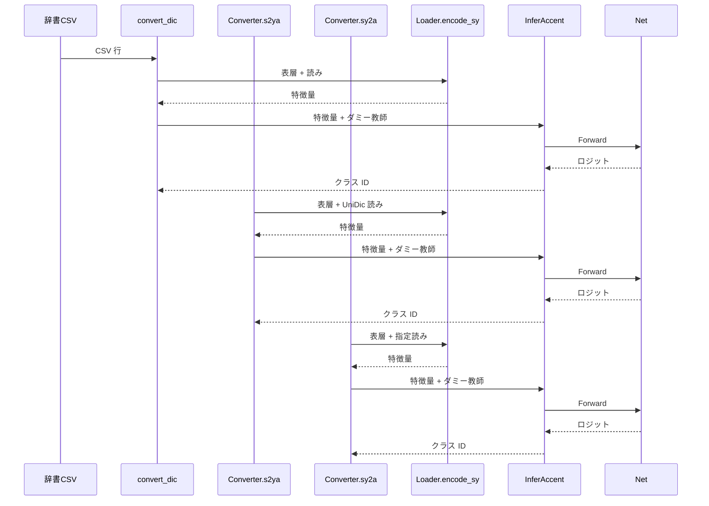

# tdmelodic リポジトリ解析レポート  

## 1. 序章  
tdmelodic は日本語アクセント辞書を構築するための総合的なツールセットです。  
リポジトリには辞書 CSV の前処理、アクセント推定用ニューラルモデル、推論 CLI、補助スクリプト、ドキュメントが同梱されています。  
本レポートではモジュール構造を精密に分解し、3 種類の推論モードがどのように連携しているかを追跡し、入力前処理からモデル推論、後処理、出力整形までのデータフローを詳述します。  
また、学習コードの有無を検証し、既存の重みがどのようなデータに基づいて作成されたと推測できるかを考察します。  

## 2. リポジトリ全体像  
ルート直下には Python パッケージ `tdmelodic` と `docs/`、`tests/`、`setup.py`、`requirements.txt` などが並びます。  
`tdmelodic` パッケージ内のサブモジュールが推論と辞書整備の中心です。  
ディレクトリ構造は以下の通りです。  

### 2.1 `tdmelodic.nn` 概要  
`tdmelodic.nn` はニューラルモデル関連の実装を保持します。  
主な構成と役割は以下の通りです。  

- `net.py`  
  表層系列・読み系列それぞれを畳み込みエンコーダで処理し、畳み込みアテンションで統合した後にアクセント遷移を 3 クラス分類します。  
- `model/encode_surface.py`  
  表層側のカテゴリ列（母音、子音、アクセント遷移、品詞、アクセント連結、語種）を EmbedID で埋め込み、`StackedConv` に渡します。  
- `model/encode_morae.py`  
  読み（モーラ列）の母音・子音列を埋め込み、同様に `StackedConv` で時系列特徴を抽出します。  
- `model/decode_accent.py`  
  アテンション後の特徴を再度畳み込みスタックに通し、1×1 畳み込みでクラス 0/1/2（下降/維持/上昇）のロジットを生成します。  
- `model/modules/*`  
  Gated Conv1D、Dilated Conv1D、畳み込みアテンションなど、各レイヤーの下位実装を提供します。  
- `loader/data_loader.py`  
  辞書 CSV エントリを解析し、ニューラルモデルが受け取れるテンソル形式に変換します。  
- `convert.py / convert_dic.py / inference.py`  
  推論のエントリポイントであり、3 つの推論モード（辞書一括付与、`s2ya`、`sy2a`）を支えます。  

### 2.2 `tdmelodic.filters` 概要  
NEologd や UniDic の生データをクリーンアップし、学習と推論の入力に適した CSV を生成します。  
`neologd_preprocess.py` の `Preprocess` クラスが全体のオーケストレーションを担当し、以下の処理を順番に执行します。  

- 重複削除（`neologd_rmdups.py`）。  
- 語種や品詞に基づくノイズ除去（`word_type.py`）。  
- 読みの長音・数字補正（`yomi/basic.py`）。  
- 助詞読みの修正や誤読検出（`yomi/particle_yomi.py`、`yomi/wrong_yomi_detection.py`）。  
- Unicode 正規化および全角変換。  
- アクセント列の追加（UniDic モード時）。  

### 2.3 `tdmelodic.util` 概要  
辞書列インデックスの抽象化や単語カテゴリー判定といった、前処理で再利用される機能を提供します。  
`dic_index_map.py` は UniDic と IPA 辞書の列番号差を吸収し、`word_type.py` は正規表現ベースで多種多様な単語カテゴリを検出します。  

## 3. 辞書入力から特徴量への変換（モジュール別解説）  
`NeologdDictionaryLoader` はニューラルモデルに渡すテンソルを生成する重要なモジュールです。  
ここでは 1 行分の CSV エントリがどのように処理されるかを「機能モジュール別」に整理します。  

### 3.1 入力正規化層（`lang/japanese/text_normalize.py`）  
- 表層形を Unicode NFKC で正規化し、英数字・カタカナの表記ゆれを統一します。  
- 記号や全角半角の揺れを除去し、後段のカテゴリ変換が失敗しないようにします。  

### 3.2 形態素解析層（`lang/mecab/unidic.py`）  
- `UniDic.get_n_best` が MeCab による N-best 解析を実行し、候補ごとの発音列 `pron` を取得します。  
- Levenshtein 距離で読み推定との一致度を測定し、推論フェーズでは最良の候補を選択します。  
- 学習フェーズではランダムに候補を選ぶことでノイズ耐性を向上させます。  

### 3.3 音韻符号化層（`lang/japanese/kana/*`）  
- `kana2roman` がカタカナモーラ列を子音・母音の交互列へ変換します。  
- `split_codes_to_vowel_and_consonant` が子音列と母音列を独立した文字列として抽出します。  
- 読み側（`Y_con`, `Y_vow`）と表層側（`S_con`, `S_vow`）の両方を同じロジックで整形します。  

### 3.4 アクセントラベル生成層（`lang/japanese/accent/*`）  
- `accent_alignment.accent_align` がアクセント核位置を L/H 列に変換します。  
- `accent_diff.simple_accent_diff` が L/H 列をモーラ間の上昇 (`U`)、下降 (`D`)、維持 (`-`) に変換し、末尾に終端記号 `.` を追加します。  
- 変換した記号は `accent_map` を介して整数 ID にマッピングされます。  

### 3.5 カテゴリーマッピング層（`lang/category/symbol_map.py`）  
- 品詞 (`POS`)、アクセント連結 (`ACCENTCON`)、語種 (`GOSHU`) を整数シンボルに変換し、未知値は 0 にフォールバックします。  
- `numeric_to_char_symbol` と `char_symbol_to_numeric` が辞書互換性を保つための文字コード表を提供します。  

### 3.6 テンソル構築層（`nn/loader/data_loader.py`）  
- 上記で得た列を空白でパディングし、長さを揃えます。  
- `roman_map` を利用して母音・子音列を整数化し、`np.int32` の NumPy 配列に変換します。  
- 生成する系列は `S_vow`, `S_con`, `S_pos`, `S_acc`, `S_acccon`, `S_gosh`, `Y_vow`, `Y_con` の 8 種類です。  
- 教師あり学習ではアクセントラベル配列 `accent_np` を加え、推論モードではダミー用配列を生成します。  

## 4. 辞書入力から特徴量への変換（時系列フロー）  
上記のモジュールを時間軸に並べ替え、1 行の CSV がテンソルになるまでの流れをステップ順に整理します。  

1. `NeologdDictionaryLoader.__len__` が CSV 行数を把握し、イテレーション回数を準備する。  
2. `__iter__` に相当する内部処理で CSV 行を読み込み、行データを `normalize_jpn` へ送る。  
3. 正規化された表層文字列を `UniDic.get_n_best` へ渡し、発音列とアクセント核を取得する。  
4. 発音列を `kana2roman` でローマ字化し、子音列・母音列に分割する。  
5. アクセント核を `accent_align` で L/H 列に変換し、`simple_accent_diff` で U/D/- ラベルに変換する。  
6. 品詞や語種を `symbol_map` が提供する辞書で整数 ID に変換する。  
7. すべての系列を空白でパディングし、長さを揃える。  
8. `roman_map` などを用いて NumPy 配列に変換し、`concat_examples` でバッチ化する。  

## 5. ニューラルモデルの内部構造  
Chainer 製の `Net` クラスは、入力系列を多段の畳み込み層でエンコードし、畳み込みアテンションで系列間の対応関係を学習します。  
以下ではモジュール単位の役割と内部処理を詳細に解説します。  

### 5.1 ハイレベル構成  
- **EncodeSurface**  
  6 種類の EmbedID を使用し、それぞれの埋め込みベクトルを加算して表層特徴を得ます。  
  `StackedConv` による畳み込みスタックは GatedConv1D を複数重ねた構造で、ダイレーション `[1, 3, 1, 3]` を採用し広い受容野を確保します。  
- **EncodeMorae**  
  読み側の母音・子音列を埋め込み、同じく `StackedConv` で時系列情報を抽出します。  
- **ConvAttention**  
  読み系列エンコーダ出力を Query、表層系列エンコーダ出力を Key/Value とし、バッチ行列積で注意行列を算出します。  
  注意行列はベクトル次元数の平方根でスケーリングし、softmax で正規化します。  
  学習時には `attention_loss` が対角性に近い分布を促す役割を担います。  
- **DecodeAccent**  
  アテンションで得たコンテキストに読みエンコーダの出力を残差的に加算し、`StackedConv` を 2 層通過させて最終的に 3 クラスのロジットを生成します。  

### 5.2 GatedConv1D と DilateConvCausal1D  
- `GatedConv1D` は入力に dropout を適用した後、`DilateConvCausal1D` を呼び出してダイレイテッド畳み込みを行います。  
- 出力を前半 (`relu`) と後半 (`sigmoid`) に分割し、要素積でゲート制御を実現します。  
- 残差接続として `(1 - gate) * x` を加算し、勾配消失を抑制します。  
- `DilateConvCausal1D` はカジュアル・非カジュアル両方に対応し、ダイレーションによる受容野拡張を担います。  

### 5.3 損失関数と推論モード  
- 学習モード (`chainer.config.train=True`) では `softmax_cross_entropy` と `attention_loss` の 2 つを返します。  
- 推論モードでは損失を計算せず、ロジットのみを返します。  
- `InferAccent` が `F.argmax` でクラス ID 配列を取得し、NumPy 形式で呼び出し元に返します。  

## 6. 推論モードの比較と時系列フロー  
tdmelodic には辞書一括付与、`s2ya`、`sy2a` の 3 形態の推論が存在します。  
以下の表と図でモード間の違いと処理順を整理します。  

| モード | 実装箇所 | 入力 | 読み取得 | 出力 | 主な用途 |  
| ------ | -------- | ---- | -------- | ---- | -------- |  
| 辞書一括付与 | `tdmelodic.nn.convert_dic.apply_all` | NEologd 等の CSV | CSV に記載済み読み + UniDic 解析 | アクセント記号付き読みを CSV に上書き | 辞書生成や配布 |  
| `s2ya` | `tdmelodic.nn.convert.Converter.s2ya` | 表層文字列 | UniDic で推定 | アクセント記号付き読み | 単語単体のアクセント付与 |  
| `sy2a` | `tdmelodic.nn.convert.Converter.sy2a` | 表層文字列 + 読み | ユーザー提供読みを使用 | アクセント記号付き読み | 読みを指定できるケース |  

### 6.1 辞書一括付与の詳細フロー  
1. `apply_all` が入力 CSV を開き、`NeologdDictionaryLoader` を `infer_mode=True` で初期化する。  
2. `SerialIterator` がミニバッチを構築し、`concat_examples` がテンソルを生成する。  
3. `InferAccent.infer` がモデルを呼び出し、アクセントラベル配列を取得する。  
4. `sep_katakana2mora` と `zip` 操作でモーラごとにアクセント記号を挿入し、文字列を生成する。  
5. 生成した読みを CSV 行へ上書きし、出力ファイルへ書き込む。  

### 6.2 `s2ya` の詳細フロー  
1. `s2ya` が表層文字列を正規化し、`UniDic.get_yomi` で読みを推定する。  
2. 表層と読みを `encode_sy` に渡して特徴量化する。  
3. `add_batch_dim` でバッチ次元を追加し、`InferAccent.infer` へ入力する。  
4. 予測ラベルを `sep_katakana2mora` と組み合わせ、アクセント記号を含む読み文字列を返す。  

### 6.3 `sy2a` の詳細フロー  
1. 読みはユーザー指定のものを利用し、`jaconv.normalize` と `jaconv.hira2kata` で正規化する。  
2. それ以外の処理は `s2ya` と同じであり、読み推定ステップをスキップする点だけが異なる。  

## 7. モデル入出力と後処理  
### 7.1 入力テンソル形状  
- `EncodeSurface` には 6 系列、`EncodeMorae` には 2 系列が渡され、いずれも形状は `batch × channel × length`。  
- 子音・母音列はモーラ数の 2 倍長を持つため、ゼロパディングで長さを揃えています。  

### 7.2 出力ラベルと記号対応  
- `DecodeAccent` の 1×1 畳み込みが `batch × 3 × length` のロジットを生成します。  
- クラス ID と記号の対応は `0 -> down_symbol (既定値 ']')`、`1 -> 維持（記号無し）`、`2 -> up_symbol (既定値 '[')`。  
- `Converter.zip_ya` がモーラ列とクラス ID を結合し、記号付き読みを構築します。  
- アクセント句境界は出力されず、モーラ間の高さ変化のみが表現されます。  

### 7.3 出力例（概念）  
- 入力: 「カタカナ」  
- 読み: カタカナ（モーラ列 `カ`, `タ`, `カ`, `ナ`）  
- 予測ラベル: `[2, 1, 0, 1]`  
- 出力文字列: `[カ]タカ]ナ`（上昇記号 `[`, 下降記号 `]`, 維持は記号なし）  

## 8. 学習コードとデータの考察  
リポジトリには明示的な学習スクリプトが存在しません。  
公開されているのは推論コードとモデル定義、事前学習済み重み `nn/resource/net_it_2500000` のみです。  
以下に推測できる学習設定をまとめます。  

### 8.1 推測されるデータソース  
- `NeologdDictionaryLoader` が学習・推論共通のデータローダであるため、NEologd（UniDic ベース）辞書が主な学習データと考えられます。  
- `infer_mode` や `valid_mode` のフラグから、訓練・検証・推論で挙動を切り替えることを想定した設計が見て取れます。  
- ただし NEologd 自体は日々更新される Web 集約辞書であり、品質が一定しないため、そのまま学習用の教師データとして採用したとは考えにくいです。  
- より現実的なのは、人手校正済みの読み＋アクセントを NEologd 互換 CSV に整形し、`NeologdDictionaryLoader` を介して学習・推論双方に供給したシナリオです。  
- ローダーの設計には学習向けの工夫（候補をランダム抽出する挙動やメモ化オプション）が組み込まれており、公開版でも推論用に同じ仕組みを流用したと見るのが自然です。  
- 実際、公式ドキュメントは学習や推論で `unidic-mecab_kana-accent-2.1.2` を利用する手順を示し、NEologd にはアクセント列が無い前提で追加の列を付与するよう指示しています。  

### 8.2 トレーニングループの想定  
- Chainer の `Trainer`/`Updater` を使用した標準的な実装が想定され、`Net` と `NeologdDictionaryLoader` を組み合わせた終端構成になっていると推測されます。  
- `attention_loss` が補助的に加算されるため、最適化には Adam などの汎用オプティマイザが使用された可能性が高いです。  
- モデルファイル名 `net_it_2500000` から、約 250 万イテレーションで学習されたと推察されます。  

### 8.3 再学習のための留意点  
- 学習スクリプトが無い場合でも、`NeologdDictionaryLoader` と `Net` を組み合わせれば再現可能です。  
- `simple_accent_diff` に依存した 3 クラス分類である点を踏まえ、教師ラベルの生成ロジックを再実装する必要があります。  
- Chainer がメンテナンス終了しているため、PyTorch などへ移植する際は `StackedConv`、`ConvAttention`、`attention_loss` の挙動を忠実に再現する必要があります。  

### 8.4 推論辞書フォーマットと精度への影響  
- `filters/neologd_preprocess.py` は UniDic モード時にアクセント列を新規に追加し、プレースホルダ `@` を挿入するだけで元の NEologd にはアクセントが含まれないことを明示しています。推論結果で置き換える前提なので、アクセント付き UniDic を学習データに用いたと見るのが自然です。  
- `convert.py` や `convert_dic.py` では、表層語を必ず UniDic Tagger（`unidic-mecab_kana-accent` 系）で再解析して品詞・語種・アクセント核を取得し、`S_pos`, `S_acc`, `S_acccon` などの系列に反映しています。そのため `s2ya` / `sy2a` モードでは UniDic 由来の高精度な特徴量が得られ、辞書モードで IPAdic 列をそのまま使うより精度が高くなる場合があります。  
- IPAdic モードは `dic_index_map` のマッピングで最低限の互換性を確保しているものの、アクセント列がダミー値のままゼロ埋めされ、品詞粒度も粗いため、学習時の分布との差が大きく精度低下の原因になります。  
- 以上から、現行モデルで最良の精度を得るには `unidic-mecab_kana-accent-2.1.2` をベースにした CSV（アクセント列・語種列を含む）を入力として用意し、NEologd などの追加語彙は UniDic と同じ列構造に整形した上で取り込むことが推奨されます。  

## 9. 制約と発展可能性  
- 出力はモーラごとの上昇/下降のみであり、アクセント句境界やイントネーション句境界の推定には対応していません。  
- UniDic で読みを取得するため、辞書未登録語では読み推定誤差が発生します。`sy2a` を利用することで部分的に回避できます。  
- テストコードは辞書フィルタと文字種判定が中心で、モデル評価のテストは含まれていません。  
- 今後の発展として、学習スクリプトの公開、句境界推定機能の追加、PyTorch などへの移植が考えられます。  

## 10. 総括  
tdmelodic は辞書前処理、ニューラルアクセント推定、CLI ツール、ドキュメントを包括した実践的なツールチェーンです。  
`filters` が辞書 CSV を浄化し、`nn/loader` が音韻特徴とアクセントラベルをテンソル化し、`net.py` が畳み込みアテンションモデルでアクセント遷移を予測します。  
推論モードは辞書一括付与、`s2ya`、`sy2a` の 3 系統があり、入力取得手段と後処理が異なるだけで内部モデルは共通です。  
学習コードは公開されていないものの、公開されたロジックから学習設定を推測でき、再学習や移植を検討する際の基盤になります。  
本レポートはモジュール別解説と時系列フローの両面からリポジトリを俯瞰し、今後の拡張に向けた技術的足場を提供します。  
